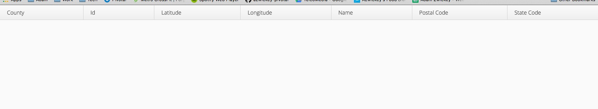
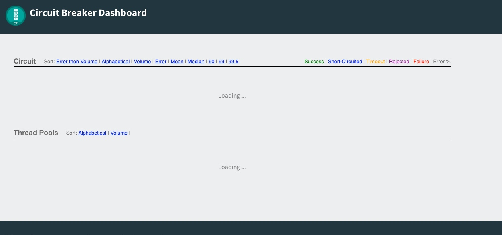
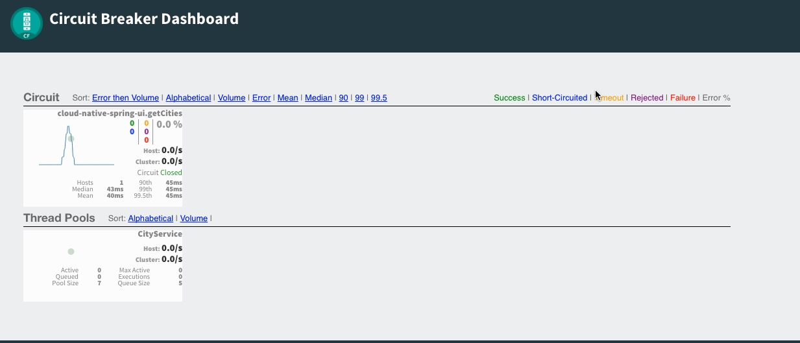

= Adding Spring Cloud Config to Boot Application

In this lab we'll utilize Spring Boot and Spring Cloud to make our UI Application more resilient.  We'll leverage Spring Cloud Circuit Breaker to configure our application behavior when our downstream dependencies are not available.  Finally, we'll use the circuit break dashboard to view metrics of the circuit breaker we implemented, which will be auto-provisioned within Cloud Foundry Pivotal Spring Cloud Services.

== Define a Circuit Breaker within the _UI Application_

. These features are added by adding _spring-cloud-services-starter-circuit-breaker_ to the classpath.  Open you Maven POM found here: */cloud-native-spring-ui/pom.xml*.  Add the following spring cloud services dependency:
+
[source, xml]
---------------------------------------------------------------------
<dependency>
  <groupId>io.pivotal.spring.cloud</groupId>
	<artifactId>spring-cloud-services-starter-circuit-breaker</artifactId>
	<version>1.0.1.RELEASE</version>
</dependency>
---------------------------------------------------------------------
+
. We also need to add a property to override some dependency management issues.  Add the following property to your Maven POM within the <properties> section:
+
[source, xml]
---------------------------------------------------------------------
<spring-cloud-connectors.version>1.2.2.RELEASE</spring-cloud-connectors.version>
---------------------------------------------------------------------

. The first thing we need to add to our application is an @EnableCircuitBreaker annotation to the Spring Boot application.  Add this annotation below the other ones on the CloudNativeSpringUIApplication declaration in the class _io.pivotal.CloudNativeSpringUIApplication_ (/cloud-native-spring-ui/src/main/java/io/pivotal/CloudNativeSpringUIApplication.java):
+
[source, java, numbered]
---------------------------------------------------------------------
@SpringBootApplication
@EnableFeignClients
@EnableDiscoveryClient
@EnableCircuitBreaker
public class CloudNativeSpringUiApplication {
---------------------------------------------------------------------

. When we introduced an @FeignClient into our application we were only required to provide an interface.  In order to wrap this with a circuit breaker we need to refactor some of our logic into a service interface.  Add the following code, which is our service implementation, to the bottom (but still within the class definition) of _io.pivotal.CloudNativeSpringUIApplication_ (/cloud-native-spring-ui/src/main/java/io/pivotal/CloudNativeSpringUIApplication.java).  NOTE - This is made slightly simpler in Spring Cloud Services 1.1, but this isn't GA'd yet.
+
[source, java, numbered]
---------------------------------------------------------------------
@Component
public class CityService {

	private CloudNativeSpringUiApplication.CityClient _client;

	@Autowired
	public CityService(CityClient client) {
		_client = client;
	}

	@HystrixCommand(fallbackMethod = "getCitiesFallback")
	public Resources<City> getCities() {
		return _client.getCities();
	}

	public Resources getCitiesFallback() {
		//We'll just return an empty response
		return new Resources(Collections.EMPTY_LIST);
	}
}
---------------------------------------------------------------------

. We'll also have to make a minor change in our ApplicationUI class to consume the new service rather than the CityClient interface. Modify the implementation of the AppUI to reference the CityService rather than the CItyClient:
+
[source, java, numbered]
---------------------------------------------------------------------
public class AppUI extends UI {

    private final CloudNativeSpringUiApplication.CityService _client;
    private final Grid _grid;

    @Autowired
    public AppUI(CloudNativeSpringUiApplication.CityService client) {
        _client = client;
        _grid = new Grid();
    }

    @Override
    protected void init(VaadinRequest request) {
        setContent(_grid);
        _grid.setWidth(100, Unit.PERCENTAGE);
        _grid.setHeight(100, Unit.PERCENTAGE);
        Collection<City> collection = new ArrayList<City>();
        _client.getCities().forEach(collection::add);
        _grid.setContainerDataSource(new BeanItemContainer<City>(City.class, collection));
    }
}
---------------------------------------------------------------------

== Deploy and test application

. Build the application
+
[source,bash]
---------------------------------------------------------------------
$ mvn clean package
---------------------------------------------------------------------

. Push application into Cloud Foundry
+
[source,bash]
---------------------------------------------------------------------
$ cf push -f manifest.yml
---------------------------------------------------------------------

. Test your application by navigating to the root URL of the application.  If the dependent cities REST service is still stopped, you should simply see a blank table.  Remember that last time you received a nasty exception in the browser?  Now your Circuit Breaker fallback method is automatically called and the fallback behavior is executed.
+

. From a commandline start the cloud-native-spring microservice (the original city service, not the new UI)
+
[source,bash]
---------------------------------------------------------------------
$ cf start cloud-native-spring
---------------------------------------------------------------------

. Refresh the UI app and you should once again see a table listing the first page of cities.
+
image::../lab05/images/ui.jpg[]

== Connect the Application to a Circuit Breaker Dashboard

.  When we modified our application to use a Hystrix Circuit Breaker our application automatically begins streaming out metrics about the health of our methods wrapped with a HystrixCommand.  We can stream these events through a AMQP message bus into Turbine to view on a Circuit Breaker dashboard.  This can be done through cloudfoundry using the services marketplace by executing the following command:
+
[source,bash]
---------------------------------------------------------------------
$ cf create-service p-circuit-breaker-dashboard standard circuit-breaker-dashboard
---------------------------------------------------------------------

. If we view the Circuit Breaker Dashboard (accessible from the _manage_ link in Apps Manager) you will see that a dashboard has been deployed but is empty (You may get an _initializing_ message for a few seconds.  This should eventually refresh to a dashboard):
+

. We will now bind our application to our circuit-breaker-dashboard within our Cloudfoundry deployment manifest.  Add these additional reference to a the service to the bottom of */cloud-native-spring-ui/manifest.yml* in the services list:
+
[source, yml]
---------------------------------------------------------------------
  services:
  - service-registry
  - circuit-breaker-dashboard
---------------------------------------------------------------------

. Push application into Cloud Foundry
+
[source,bash]
---------------------------------------------------------------------
$ cf push -f manifest.yml
---------------------------------------------------------------------

. Refresh your UI application to force some traffic though the circuit breaker call path.  After doing this you should now see the dashboard populated with metrics about the health of your Hystrix circuit breaker:
+

