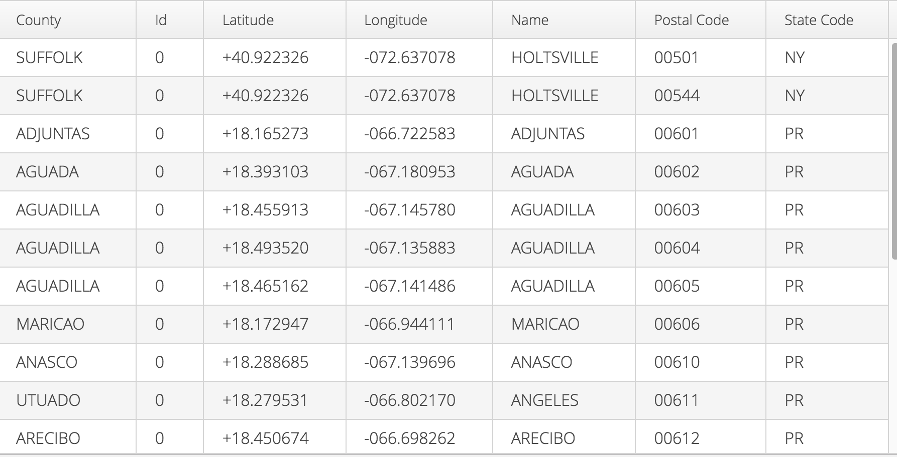
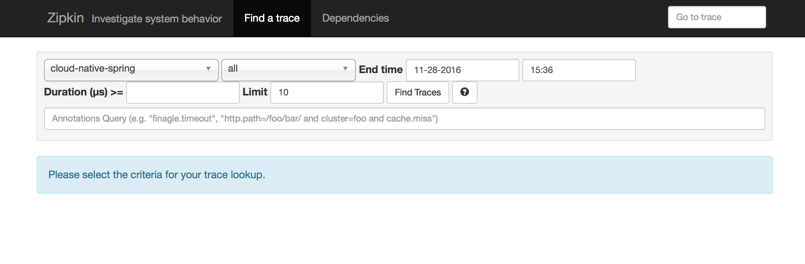
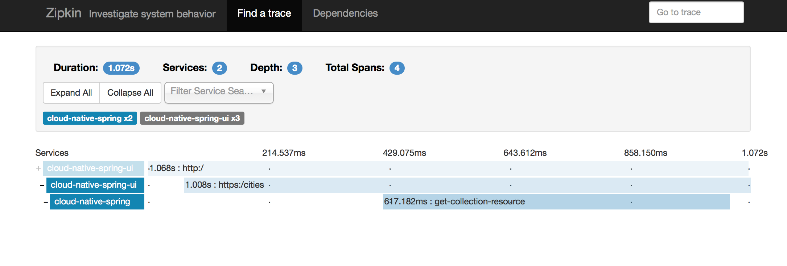
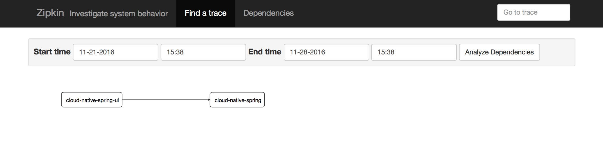

= Distributed Tracing with Spring Cloud Sleuth and Zipkin

In this lab, we'll build on what we've done so far, using Spring Cloud Sleuth to instrument calls from one service to another and Zipkin to capture store and display those calls.

== Deploy the Zipkin Server

. First we'll need to deploy the server that will listen on an HTTP endpoint for out-of-band tracing messages.  There is a pre-built server in this directory.
+
[source, shell]
---------------------------------------------------------------------
$ cd $labs_home/labs/lab05/zipkin-query-service
$ ./mvnw clean package
$ ./cf push #make sure that you have a RabbitMQ service in your space named 'rabbit'
---------------------------------------------------------------------
+

. verify that the server is up and running.  Grab the route of your server and put it in the browser followed by /api/v1/services.  You should see JSON for and empty list: `[]`

== Add Sleuth and Zipkin to the Service project

. next go back into your cloud-native-spring project and update the `application.yml`
. add the `spring.zipkin.base-url` property with the host of your Zipkin server.  Your final file might look like the following with the hostname replaced by the host of your Zipkin server.  It is _very important_ that you include the `:80` and the end of the hostname.

+
[source, yml]
---------------------------------------------------------------------
spring:
  application:
    name: cloud-native-spring
  zipkin:
    base-url: http://zipkin-query-service-unnymphean-dentil.cfapps.io:80

endpoints:
  health:
    sensitive: false

security:
  basic:
    enabled:  false

management:
  security:
    enabled: false
---------------------------------------------------------------------
+
. next, add the following to your pom.xml in the `<dependencies>` section.
+
[source,xml]
---------------------------------------------------------------------

        <dependency>
            <groupId>org.springframework.cloud</groupId>
            <artifactId>spring-cloud-sleuth-zipkin-stream</artifactId>
        </dependency>
        <dependency>
            <groupId>org.springframework.cloud</groupId>
            <artifactId>spring-cloud-starter-stream-rabbit</artifactId>
        </dependency>
---------------------------------------------------------------------
+

. Finally, we'll need to make some small changes to the java code.  Add the following to your _CloudNativeSpringApplication.java_ file.
If the Maven dependencies are loaded in your IDE, the imports should be straightforward.

+
[source,java,numbered]
---------------------------------------------------------------------
    @Bean
    public AlwaysSampler defaultSampler() {
        return new AlwaysSampler();
    }
---------------------------------------------------------------------
+
. Build, test, and deploy
+
[source,bash]
---------------------------------------------------------------------
$ ./mvnw clean package
$ cf push
---------------------------------------------------------------------

== Add Sleuth and Zipkin to the UI project

. In your cloud-native-spring-ui project, create a `src/main/resources/application.yml` file if necessary.

. Sleuth and Zipkin introduce some dependencies that turn on security by default.  We need to disable that as well as point this project to the Zipkin server.  Your `application.yml` may look as follows:
Don't forget to change the hostname of the Zipkin server to match your particular instance.
+
[source,yml]
---------------------------------------------------------------------
spring:
  zipkin:
    base-url: http://zipkin-query-service-unnymphean-dentil.cfapps.io:80

info:
  build:
    artifact: @project.artifactId@
    name: @project.name@
    description: @project.description@
    version: @project.version@

endpoints:
  health:
    sensitive: false

security:
  basic:
    enabled:  false

management:
  security:
    enabled: false
---------------------------------------------------------------------

. Next we add our dependencies to `pom.xml`
+
[source, xml]
---------------------------------------------------------------------
  			<dependency>
  				<groupId>org.springframework.cloud</groupId>
  				<artifactId>spring-cloud-sleuth-zipkin</artifactId>
  			</dependency>
  			<dependency>
  				<groupId>org.springframework.cloud</groupId>
  				<artifactId>spring-cloud-starter-sleuth</artifactId>
  			</dependency>

---------------------------------------------------------------------
+
. Add the Sampler bean to the `CloudNativeSpringUIApplication` class.
+
[source, java]
---------------------------------------------------------------------
	@Bean
	public AlwaysSampler defaultSampler() {
		return new AlwaysSampler();
	}

---------------------------------------------------------------------
+
. And finally, double check that you have your _rabbit_ service declared in manifest.yml
+
[source, yml]
---------------------------------------------------------------------
services:
  - service-registry
  - rabbit
  - circuit-breaker

---------------------------------------------------------------------
+
. Build, test, and deploy
+
[source,bash]
---------------------------------------------------------------------
$ ./mvnw clean package
$ cf push
---------------------------------------------------------------------

== Run a local Zipkin UI
. you can explore your Zipkin server by going the `/mappings` endpoint and following some of the endpoints you see listed there.
However, the UI is far preferable.  In the _labs05_ directory, there is a `zipkin-web` project.  Open the `zipkin-web.sh` file and replace the name of the server with the details of your Zipkin server.

+
[source,bash]
---------------------------------------------------------------------
#!/usr/bin/env bash

java -jar lib/zipkin-web-all.jar -zipkin.web.port=:9412 -zipkin.web.rootUrl=/ -zipkin.web.query.dest=zipkin-query-service-unnymphean-dentil.cfapps.io:80

---------------------------------------------------------------------
+
`zipkin.web.query.dest` should point to your Zipkin server, the same url you plugged into application.yml previously, minus the `http://`
. Now you can run the local Zipkin UI and point your browser to localhost:9412.  On Windows, you will need to pull the java command out of the script and run it manually.  You can also look at _Git Bash_ for running basic shell scripts on Windows.

+
[source,bash]
---------------------------------------------------------------------
$ ./zipkin-web.sh
---------------------------------------------------------------------

== Explore Zipkin

. First we'll need to generate some data with our newly deployed apps.  Go you your spring-cloud-native-ui app in your browser and refresh it a few times.
+

+
. Then navigate to your local Zipkin ui on `localhost:9412`
+

+
. Explore some of the spans under the `cloud-native-spring-ui` heading.  You should see some Spans that traverse the client and the server.
+

+
. Finally, click the `dependencies` link to see your impressing microservice dependency graph.
+

